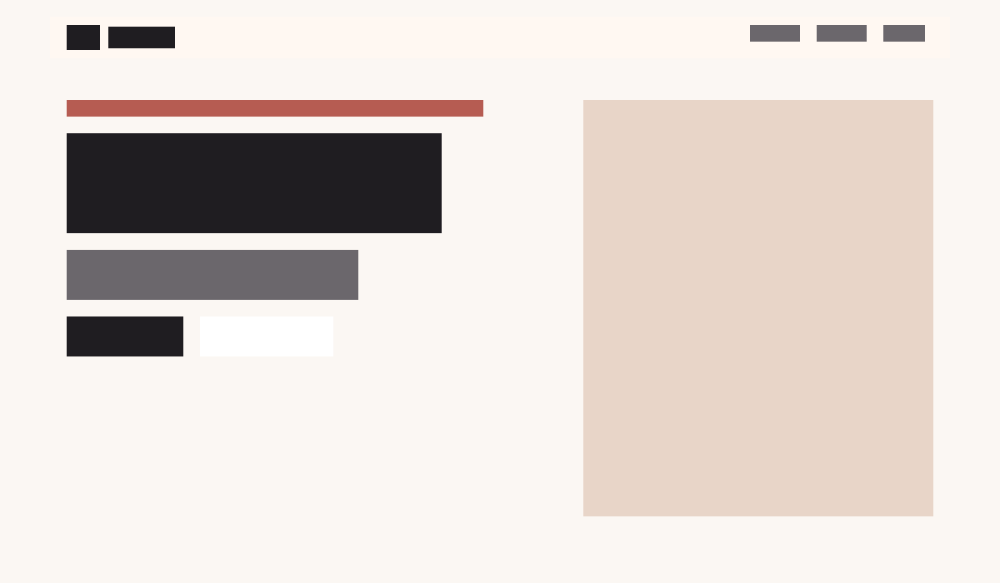
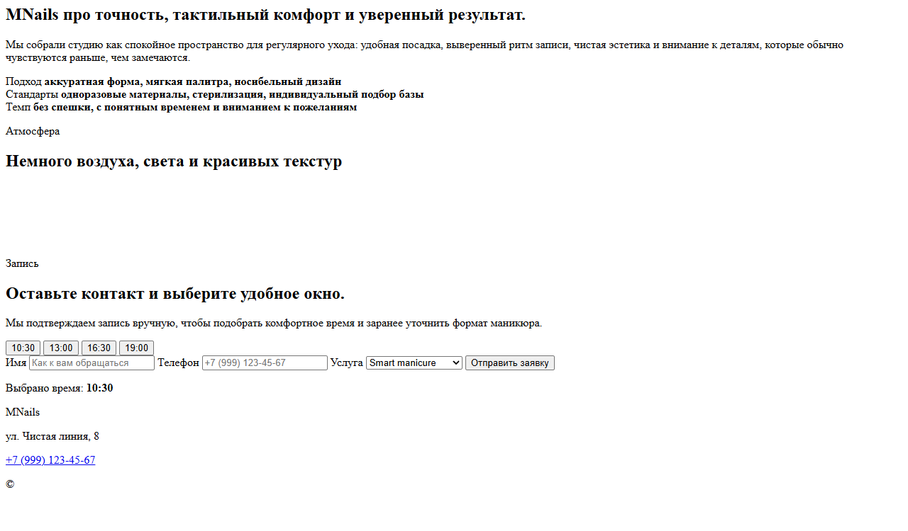
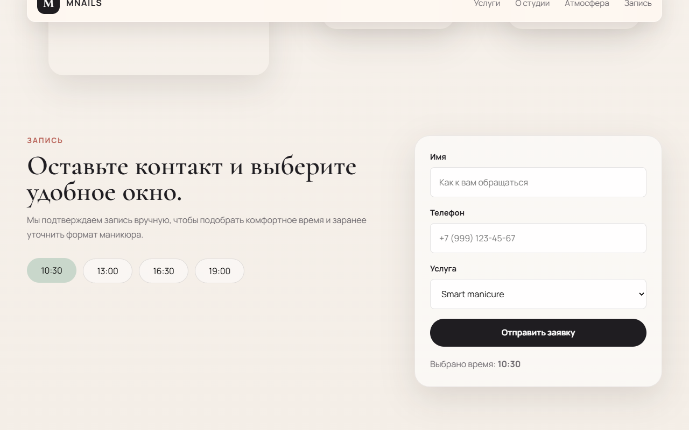
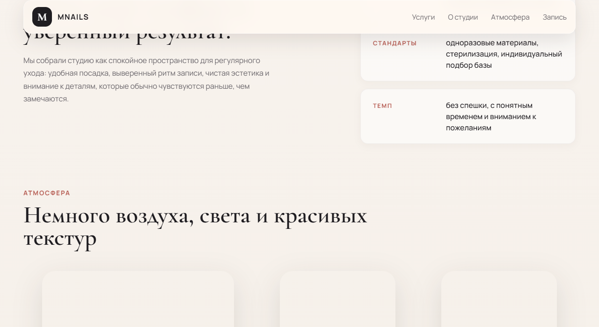

# MNails — Маникюрная студия

Современный лендинг для маникюрной студии с минималистичным дизайном, плавными анимациями и формой записи.



## Особенности

- **Адаптивный дизайн** — корректно отображается на всех устройствах
- **Плавные анимации** — IntersectionObserver для появления секций при скролле
- **Форма записи** — выбор времени, валидация, подтверждение
- **Мобильное меню** — бургер-кнопка с анимацией
- **Sticky-шапка** — меняет стиль при скролле
- **SCSS-архитектура** — переменные, миксины, вложенность



## Технологии

- HTML5 (семантическая разметка, a11y)
- SCSS (CSS-переменные, BEM, адаптив)
- JavaScript (ES6+, DOM API, IntersectionObserver)
- Vite (сборка, dev-сервер, HMR)

## Структура

```
New_lending/
├── index.html
├── assets/
│   ├── scss/style.scss
│   └── js/main.js
├── vite.config.js
└── package.json
```



## Запуск

```bash
# Установка зависимостей
npm install

# Dev-сервер с hot reload
npm run dev

# Продакшен-сборка
npm run build

# Предпросмотр сборки
npm run preview
```



## Демо

Откройте `dist/index.html` после сборки или запустите `npm run dev` для локальной разработки.

---

© 2026 MNails
